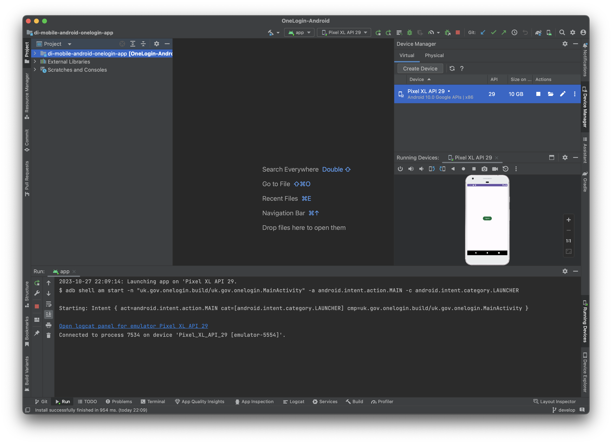
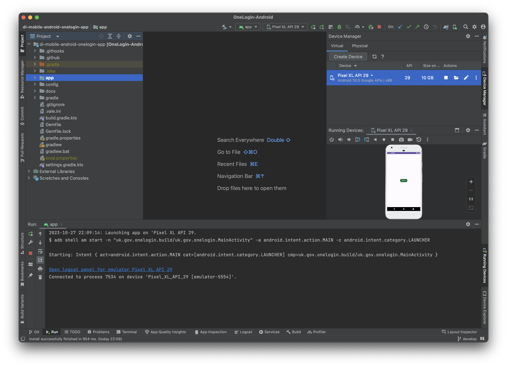
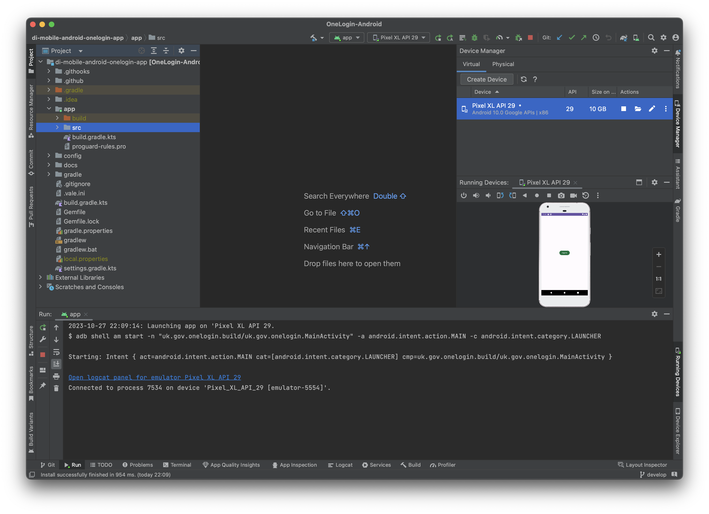
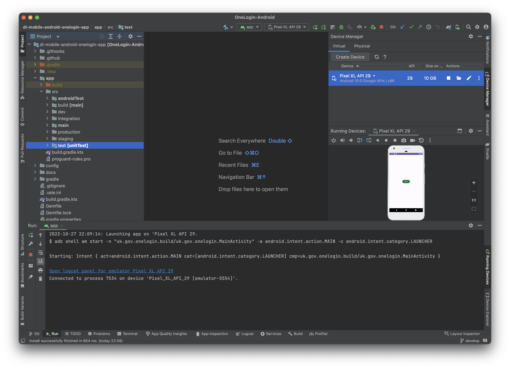
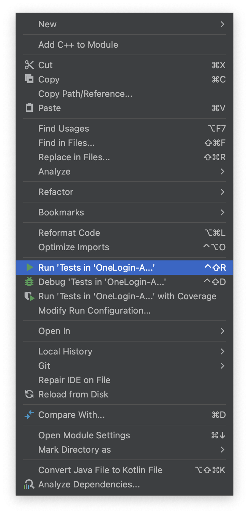
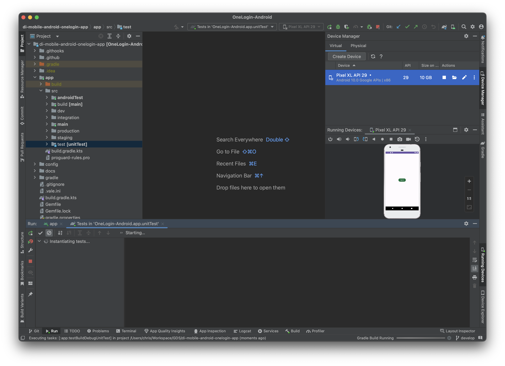
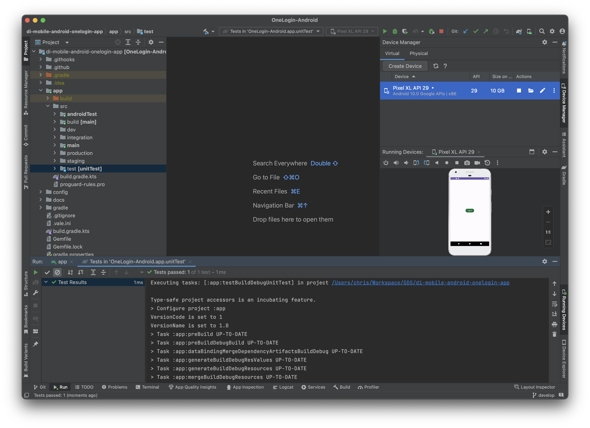
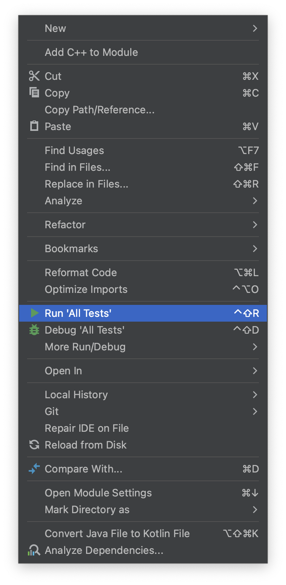
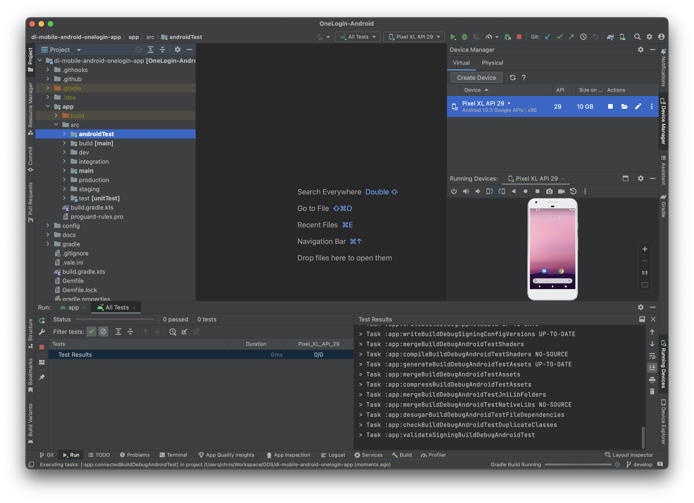
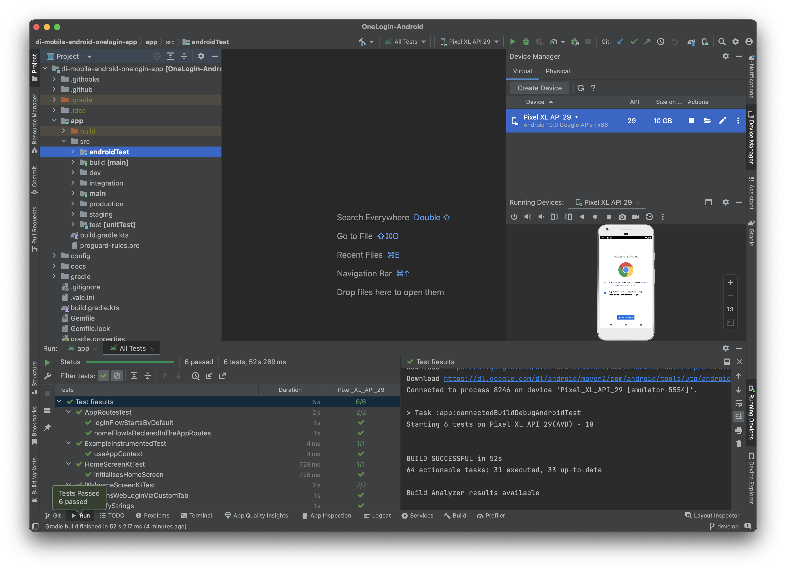

# How To - Running the tests

## Introduction

This guide shows you how to run both the unit and instrumentation tests for an Android app.

## Finding the tests

With the project open in Android Studio, expand the project directory in the `Project` tab:

Now expand the `app` directory:

And finally the `src` directory:

## Running the unit tests

Right click on the `test [unitTest]` directory:

Click the `Run Tests...` option and the test execution will begin:

Once complete the test results are displayed:

## Running the instrumentation tests

Right click on the `androidTest` directory:

Click the `Run 'All Tests'` option and the test execution will begin:

While the tests are running you will see the AVDs screen launching and relaunching the app and flicking through pages as each view or journey is tested.

Once complete the test results are displayed:

